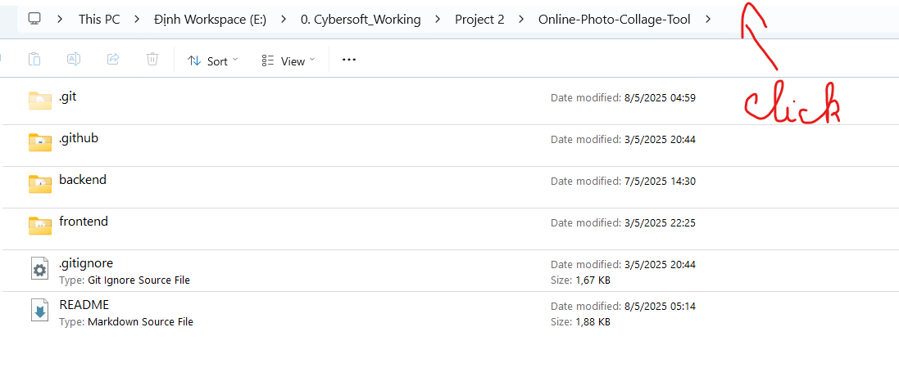
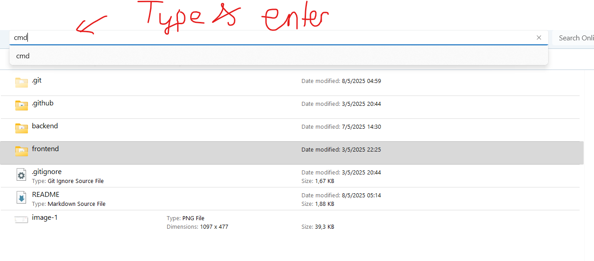
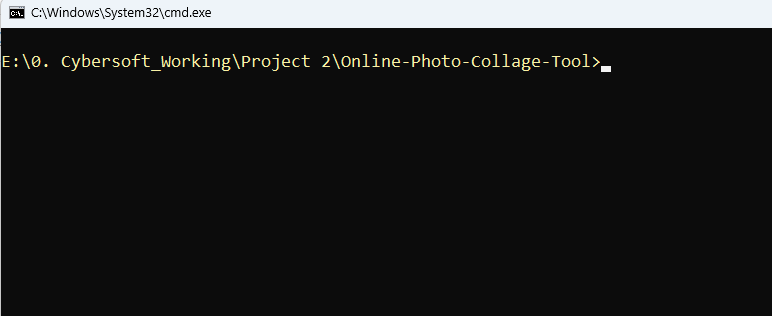

<h1 align="center">📸 Online Photo Collage Tool</h1>

<p align="center">
 Create simple online photo collages with support for downloading, customizable orientation (vertical/horizontal), borders, and background color.
</p>

---


## 📦 **Features**

- Upload and arrange images horizontally or vertically
- Choose background color and border thickness
- Preview the collage before downloading
- Download the final image to your device
- User-friendly interface

---

## 🧰 **Technologies Used**

- Frontend: ReactJS + TailwindCSS
- Backend: Flask (Python)
- Image processing: PIL (Pillow)
- Container: Docker

---

## 🛠️ **Local Development** 

### 🔧 **Requirements**

- Docker & Docker Compose
- VSCode
- Git

### 📥 **Clone project**

```bash
git clone https://github.com/your-username/online-photo-collage.git
cd online-photo-collage
```

## 🛠️ **Project Using Guide**

### **1. Project Structure**
```
Online-Photo-Collage-Tool
├── backend/  # Flask API - xử lý ảnh
│   ├── app/
|   |   ├── __init__.py
|   |   ├── config.py
|   |   ├── routes.py
|   |   ├── tasks.py
|   |   └── utils.py
│   ├── instance/
│   ├── static/            # store image collage
│   ├── uploads/
|   ├── venv/
|   ├── docker-compose.yml
|   ├── Dockerfile
|   ├── requirements.txt
|   └── run.py             # main file
│
├── frontend/              # React UI
│   ├── public/
│   ├── src/
│   │   ├── components/
│   │   |   ├── Content/
│   │   |   └── Sidebar/
│   │   ├── constant/
│   │   ├── App.js
│   │   ├── App.css
│   │   └── index.js
│   └── tailwind.config.js
├── README.md
└── .gitignore
```

### **2. Run Project**
Open Terminal and following:
## Frontend:



```
    Type this into Terminal:
    cd frontend -> npm install -> npm start -> Enter
```
Link: http://localhost:3000

---
## Backend:
Open Terminal, Docker and following:


```
    Type this into Terminal:
    cd backend -> docker-compose up --build -> Enter
```
Link: http://127.0.0.1:5000
- createTask:   http://127.0.0.1:5000/create-task
- checkStatus:  http://127.0.0.1:5000/check-status?task_id={task_id}
- getCollage:   http://127.0.0.1:5000/get-collage?{imageURL}